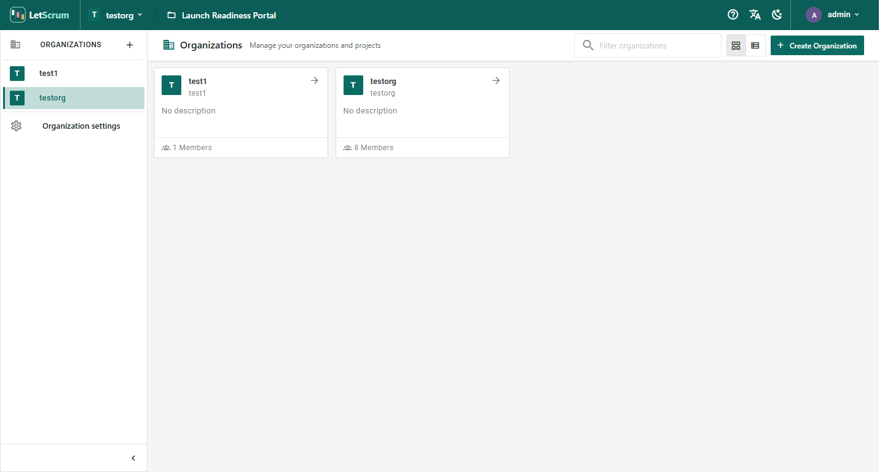
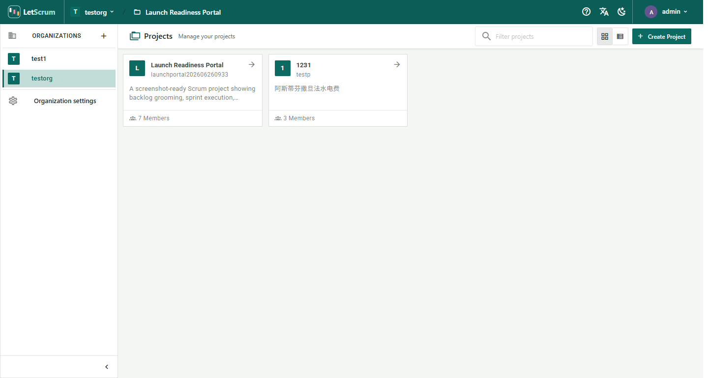
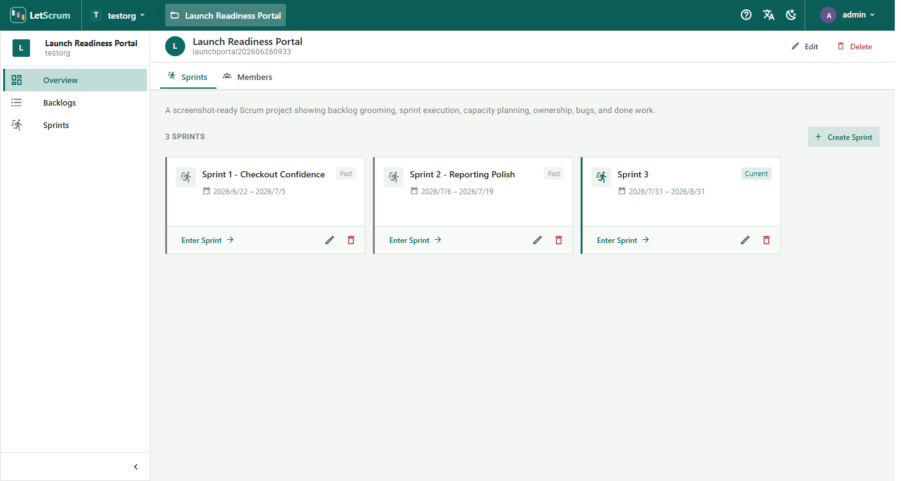
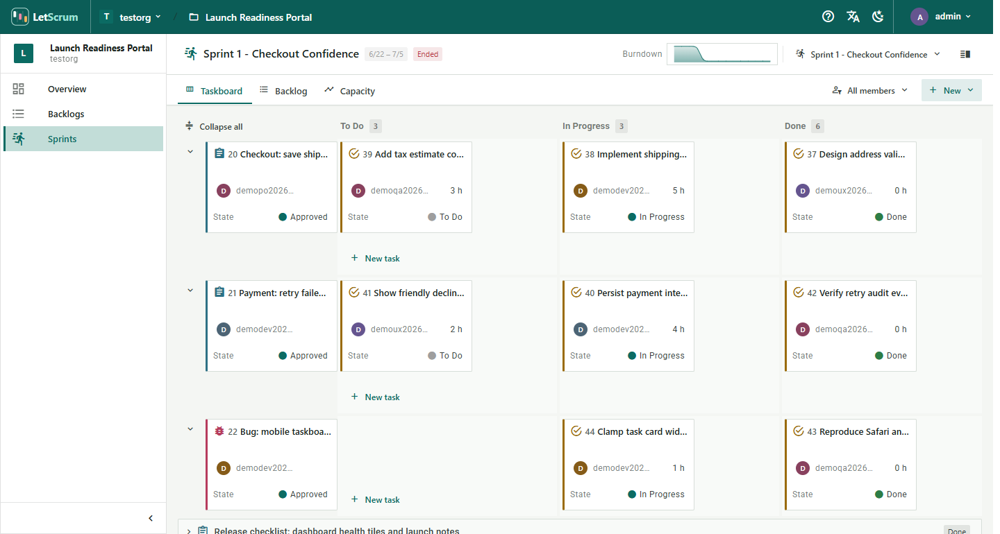
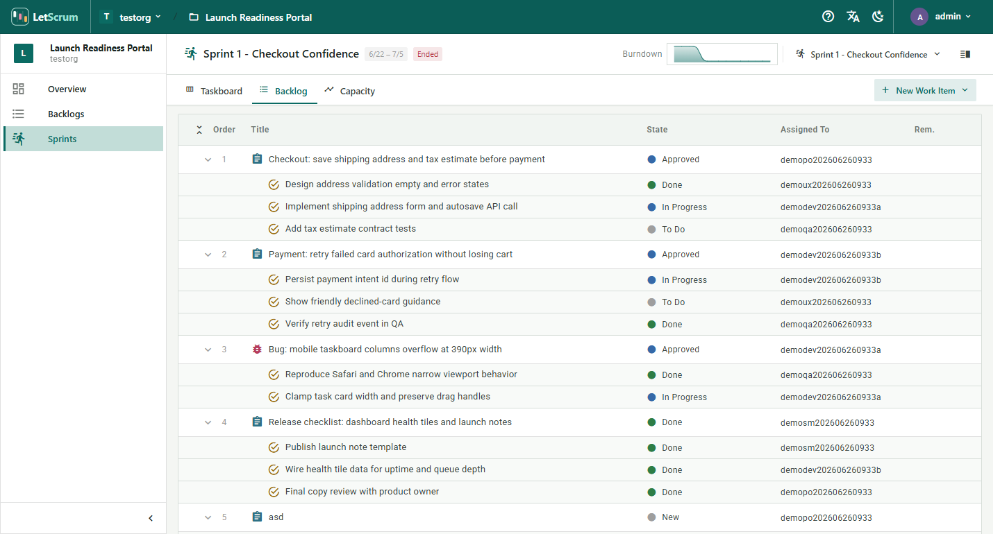
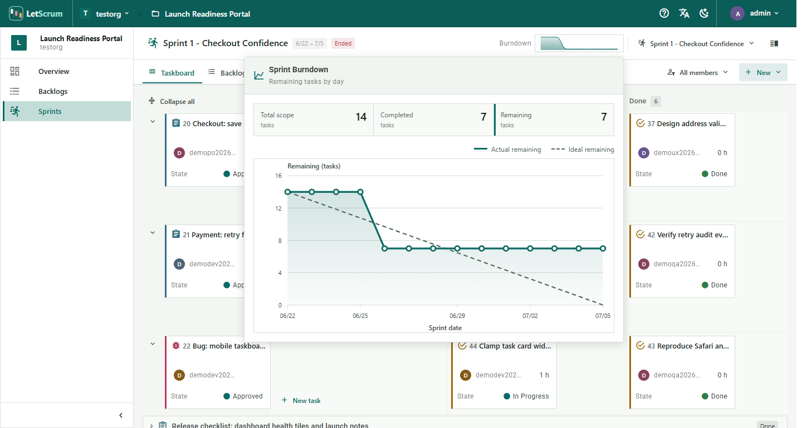

# LetScrum UI

A modern, responsive user interface for the LetScrum project management platform, built with Vue 3 and Vuetify.

## Live Demo

| | |
| --- | --- |
| **URL** | [https://letscrum.learnmark.com/](https://letscrum.learnmark.com/) |
| **Username** | `admin` |
| **Password** | `admin` |

## 🚀 Overview

LetScrum UI provides a comprehensive interface for agile project management. It features a focused enterprise workspace with a distinctive LetScrum visual system for managing organizations, projects, sprints, and backlogs.

## Screenshots

| Organizations | Projects |
| --- | --- |
|  |  |

| Project Overview | Sprint Taskboard |
| --- | --- |
|  |  |

| Sprint Backlog | Sprint Burndown |
| --- | --- |
|  |  |

## ✨ Features

- **Modern UI/UX**: Clean, card-based interface with a focus on usability and aesthetics.
- **Project Management**: Create and manage projects, view project details, and track progress.
- **Agile Tools**: Full support for Sprints, Backlogs, and Taskboards.
- **Organization Management**: Manage organizations and members.
- **User Management**: Authentication, user profiles, and role-based access control.
- **Internationalization**: Built-in support for English and Chinese (zh) locales.
- **Responsive Design**: Optimized for both desktop and mobile devices.

## 🛠️ Tech Stack

- **Framework**: [Vue 3](https://v3.vuejs.org/)
- **UI Library**: [Vuetify 3](https://vuetifyjs.com/)
- **Build Tool**: [Vite](https://vitejs.dev/)
- **State Management**: [Pinia](https://pinia.vuejs.org/)
- **Routing**: [Vue Router](https://router.vuejs.org/)
- **HTTP Client**: [Axios](https://axios-http.com/)
- **Internationalization**: [Vue I18n](https://kazupon.github.io/vue-i18n/)

## 📦 Installation

1. **Clone the repository**

   ```bash
   git clone https://github.com/letscrum/letscrum-ui.git
   cd letscrum-ui
   ```

2. **Install dependencies**

   ```bash
   npm install
   ```

## 💻 Development

To start the development server with hot-reload:

```bash
npm run dev
```

The application will be available at `http://localhost:3000`.

## 🏗️ Build

To build the project for production:

```bash
npm run build
```

The build artifacts will be stored in the `dist/` directory.

## 🐳 Docker Support

This project includes a `Dockerfile` for containerized deployment.

**Build the Docker image:**

```bash
docker build -t letscrum-ui .
```

**Run the container:**

```bash
docker run -d -p 80:80 letscrum-ui
```

## 📄 License

Licensed under the [Apache License, Version 2.0](LICENSE).
